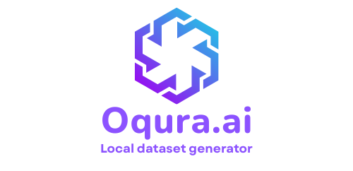
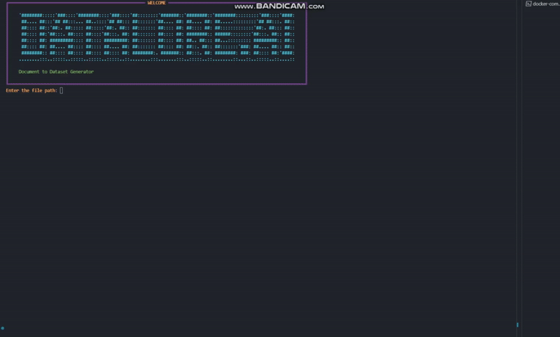
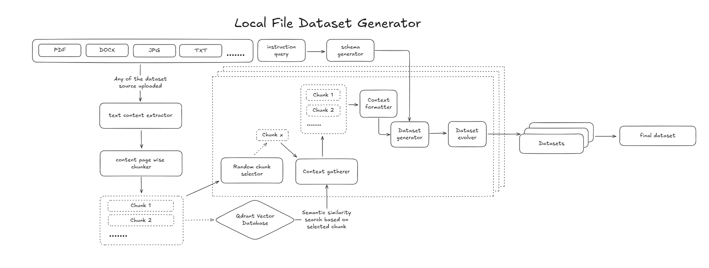

<!-- <div align="center">
  
</div> -->
<h1>thesius.ai - local dataset generator</h1>
<p align="center">
  <a href="https://github.com/Datalore-ai/datalore-localgen-cli/stargazers"></a>
  <a href="https://github.com/Datalore-ai/datalore-localgen-cli/blob/main/LICENSE"></a>
  <a href="https://github.com/Datalore-ai/datalore-localgen-cli/commits/main"></a>
  
  <a href="https://github.com/Datalore-ai/datalore-localgen-cli/graphs/contributors"></a>
</p>
<br/>
<br/>
<div align="center">
  
</div>


## Overview

thesius-localgen-cli is a terminal tool for generating structured datasets from local files like PDFs, Word docs, images, and text. You upload a file and describe the kind of dataset you want. It extracts the content, uses semantic search to understand and gather relevant context, applies your instructions through a generated schema, and outputs clean, structured data. Perfect for converting raw or unstructured local documents into ready-to-use datasets for training, analysis, or experimentation, all without manual formatting.


## How It Works

- give the path to a local directory containing all kind files mentioned (PDF, DOCX, JPG, TXT, etc.)  
- extracts text from the uploaded document  
- splits the content page-wise into smaller chunks  
- randomly selects a chunk to use as a reference  
- runs a semantic similarity search using Qdrant to find related chunks  
- gathers similar chunks to build a context window  
- formats the gathered context cleanly  
- generates structured data using an instruction query and generated schema  
- evolves and improves the dataset iteratively  
- combines generated samples into a complete dataset  
- exports the final dataset in CSV or JSON format via the terminal  


## Workflow

This diagram shows how Datalore takes a local file and an instruction, extracts and understands the content, and turns it into a structured dataset.




## Getting Started

Follow these steps to set up and run the project locally.

### Prerequisite: Install `uv`

`uv` is required to manage the virtual environment and dependencies.

You can download it from the official [uv GitHub repository](https://github.com/astral-sh/uv), which includes platform-specific installation instructions.

### 1. Clone the Repository

```bash
git clone https://github.com/Datalore-ai/datalore-localgen-cli.git
cd datalore-localgen-cli
```

### 2. Create a Virtual Environment

Use `uv` to create a virtual environment:

```bash
uv venv
```

### 3. Activate the Virtual Environment

Activate the environment depending on your OS:

**Windows:**
```bash
.venv\Scripts\activate
```

**macOS/Linux:**
```bash
source .venv/bin/activate
```

### 4. Set Up Environment Variables

Copy the example `.env` file and add your API keys:

```bash
cp .env.example .env
```

Open the `.env` file in a text editor and fill in the required fields:

```
OPENAI_API_KEY=your_openai_api_key_here
MISTRAL=your_mistral_api_key_here

# defaults
QDRANT_URL=http://localhost:6333
COLLECTION_NAME=knowledge_base
EMBEDDING_MODEL=BAAI/bge-small-en-v1.5
```

These keys are essential for the application to work correctly.

### 5. Install Dependencies

Install required packages using:

```bash
uv pip install -r requirements.txt
```

### 5. Set Up Docker for Qdrant vectorDB

Make sure you have Docker and Docker Compose installed. Then start the required services (e.g., Qdrant) using:

```bash
docker-compose up --build
```

This will spin up the necessary services in the background.

### 6. Run the Application

Once the environment and services are ready, start the application:

```bash
python main.py
```

You're all set to go! The application will now guide you through the dataset creation process step by step and the final dataset will be saved in the output_files directory.

### Optional: `configuration.py`

You can customize how the tool behaves using the `configuration.py` file. It lets you adjust 2 parameters for this application.

```python
CONFIGURATION = {
    "rows_per_context": 5,           # Number of QAs or rows generated per chunk
    "evolution_depth": 1,            # How much transformation/evolution to apply (1 = minimal, 3 = very complex)
}
```

## Authors

- [Swaraj Biswal](https://github.com/SWARAJ-42)
- [Swadhin Biswal](https://github.com/swadhin505)  


## Contributing

If something here could be improved, please open an issue or submit a pull request.

### License

This project is licensed under the MIT License. See the `LICENSE` file for more details.

